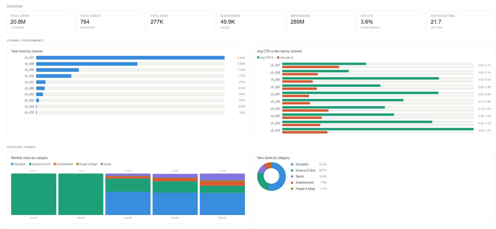

# yt_analytics

A DBT project built on YouTube channel performance data for a digital content agency.
Models cover 10 channels, 772 videos, and ~34K daily metric records across 5 content categories.

---

## Stack

| Tool | Role |
|---|---|
| DBT 1.11 | Transformation layer |
| DuckDB 1.10 | Local analytical database |
| DBeaver | SQL client / inspection |
| Python | Data exploration and QA |

---

## Project Structure


```
yt_analytics/
├── seeds/                          # Raw CSV source files loaded via dbt seed
│   ├── dim_category.csv
│   ├── dim_channel.csv
│   ├── dim_video.csv
│   └── fact_daily_video_metrics.csv
│
├── snapshots/                      # SCD Type 2 history tracking
│   ├── snap_dim_channel.sql
│   └── schema.yml
│
├── models/
│   ├── staging/                    # Layer 1: casting, renaming, deduplication
│   │   ├── sources.yml
│   │   ├── schema.yml
│   │   ├── stg_dim_category.sql
│   │   ├── stg_dim_channel.sql
│   │   ├── stg_dim_video.sql
│   │   └── stg_fact_daily_video_metrics.sql
│   │
│   ├── intermediate/               # Layer 2: wide joined table
│   │   ├── schema.yml
│   │   └── int_video_metrics_joined.sql
│   │
│   └── marts/                      # Layer 3: business-facing aggregations
│       ├── schema.yml
│       ├── mart_channel_summary.sql
│       ├── mart_video_performance.sql
│       └── mart_category_trends.sql
│
├── dbt_project.yml
└── dev.duckdb                      # Local DuckDB database file
```

---

## Data Flow

```
seeds (raw CSVs)
    └── staging        (view / table — clean, cast, deduplicate)
         └── intermediate  (incremental table — wide joined grain)
              └── marts    (views — aggregated business metrics)
```

---

## Materialization Strategy

| Model | Materialization | Reason |
|---|---|---|
| `stg_dim_category` | view | Tiny table, no transformation cost |
| `stg_dim_channel` | view | Replaced by snapshot for history tracking |
| `stg_dim_video` | view | Small, simple casts only |
| `stg_fact_daily_video_metrics` | **table** | 34K rows, strptime cast + window function dedup — materialized to avoid DuckDB type resolution issues through view chains |
| `int_video_metrics_joined` | **incremental** | Central wide table; merge on `metric_id` (VARCHAR surrogate key); only new dates processed on each run |
| `mart_channel_summary` | view | Aggregation on top of incremental int layer |
| `mart_video_performance` | view | Aggregation on top of incremental int layer |
| `mart_category_trends` | view | Aggregation on top of incremental int layer |

### Why `stg_fact` is a table, not a view

DuckDB has a known binder bug where `DATE` columns referenced through a view chain cause an internal type resolution error (`inequal types: DATE != VARCHAR`). Materializing the staging fact model as a physical table forces DuckDB to store the cast DATE column explicitly, resolving the issue for all downstream models.

---

## Upsert Logic

### Intermediate layer — `int_video_metrics_joined`

Uses `incremental_strategy='merge'` with a VARCHAR surrogate key to avoid DuckDB's DATE merge bug.

**Surrogate key:** `metric_id = video_id || '_' || cast(metrics_date as varchar)`

```sql
{{ config(
    materialized='incremental',
    unique_key='metric_id',
    incremental_strategy='merge'
) }}


    where metrics_date > (select max(metrics_date) from {{ this }})

```

On the first run (or `--full-refresh`), the full history is loaded. On subsequent runs, only rows with a `metrics_date` newer than the current maximum are merged in. This is safe because staging deduplicates the source before this model runs.

### Staging dims — `stg_dim_category`, `stg_dim_video`

New records are inserted; changed records (e.g. updated category name or video length) are updated in place. The dims themselves are views — upsert behaviour is inherited from the seed reload cycle.

---

## Slowly Changing Dimensions (SCD Type 2) — `snap_dim_channel`

Channel names can change over time. Rather than overwriting, we track full history using a DBT snapshot.

**File:** `snapshots/snap_dim_channel.sql`

```sql

{{
    config(
        target_schema='snapshots',
        unique_key='channel_id',
        strategy='check',
        check_cols=['channel_name'],
        invalidate_hard_deletes=True
    )
}}
select ...

```

DBT automatically adds:

| Column | Meaning |
|---|---|
| `dbt_valid_from` | When this version of the record became active |
| `dbt_valid_to` | When it was superseded (`NULL` = currently active) |
| `dbt_scd_id` | Unique key per historical record |

To query only the current active channel name:

```sql
select * from snap_dim_channel
where dbt_valid_to is null
```

---

## Data Quality Tests

Tests are split across three schema files, one per layer.

### `models/staging/schema.yml`

| Test | Column | Model |
|---|---|---|
| `unique` + `not_null` | `category_id` | stg_dim_category |
| `unique` + `not_null` | `video_id` | stg_dim_video |
| `not_null` | `channel_id`, `video_published_date`, `video_length_seconds` | stg_dim_video |
| `relationships` | `channel_id → stg_dim_channel` | stg_dim_video |
| `relationships` | `category_id → stg_dim_category` | stg_dim_video |
| `accepted_values` | `video_type ∈ ['Long-form', 'Short-form']` | stg_dim_video |
| `expression_is_true` | `video_length_seconds > 0` | stg_dim_video |
| `not_null` | `video_id`, `metrics_date` | stg_fact |
| `expression_is_true` | `views >= 0` | stg_fact |
| `expression_is_true` | `watch_time_minutes >= 0` | stg_fact |
| `expression_is_true` | `comments >= 0` | stg_fact |
| `expression_is_true` | `likes >= 0` | stg_fact |
| `expression_is_true` | `shares >= 0` | stg_fact |
| `expression_is_true` | `thumbnail_impressions >= 0` | stg_fact |
| `expression_is_true` | `ctr_pct between 0 and 1` | stg_fact |
| `unique_combination_of_columns` | `(video_id, metrics_date)` | stg_fact |

### `models/intermediate/schema.yml`

Lighter tests — data quality was already enforced at staging. These guard against join fan-outs or broken references.

| Test | Column/Combination |
|---|---|
| `unique_combination_of_columns` | `(video_id, metrics_date)` |
| `not_null` | `video_id`, `metrics_date`, `channel_id`, `category_id` |
| `expression_is_true` | `views >= 0` |
| `accepted_values` | `video_type ∈ ['Long-form', 'Short-form']` |

### `models/marts/schema.yml`

Confirms aggregations produced sensible outputs.

| Test | Column | Model |
|---|---|---|
| `unique` + `not_null` | `channel_id` | mart_channel_summary |
| `expression_is_true` | `total_views >= 0` | mart_channel_summary |
| `expression_is_true` | `like_rate between 0 and 1` | mart_channel_summary |
| `unique` + `not_null` | `video_id` | mart_video_performance |
| `expression_is_true` | `like_rate between 0 and 1` | mart_video_performance |
| `unique_combination_of_columns` | `(category_name, metrics_month, video_type)` | mart_category_trends |

---

## Key Data Quality Issues Found in Source Data

| Issue | Table | Action |
|---|---|---|
| 5 null `video_id`s | dim_video | Filtered in staging |
| 7 duplicate `video_id`s | dim_video | Deduplicated with `ROW_NUMBER()` |
| 3 orphaned `channel_id`s (typos: `ch_01`, `ch_0012`) | dim_video | Left join; these videos have null channel attributes |
| 22 duplicate `(video_id, metrics_date)` pairs | fact | Deduplicated — kept row with highest views |
| 5 negative `views`, 11 negative `watch_time_minutes` | fact | Filtered out |
| 329 negative `likes` (min = -3, 201 videos affected) | fact | Clamped to 0 with `greatest(..., 0)` — YouTube removes fraudulent likes |
| December 2025 entirely missing | fact | Documented — usable date range is Jan–Mar 2026 |
| Views stored as comma-formatted VARCHAR (`"2,279"`) | fact seed | Cleaned with `replace("Views", ',', '')` before cast |

---

## Metrics Reference

| Metric | Formula |
|---|---|
| Total Views | `SUM(views)` |
| Total Watch Time (hours) | `SUM(watch_time_minutes) / 60` |
| Avg Watch Time per View | `SUM(watch_time_minutes) / NULLIF(SUM(views), 0)` |
| Like Rate | `SUM(likes) / NULLIF(SUM(views), 0)` |
| Avg CTR | `AVG(ctr_pct)` |
| Engagement Rate | `(SUM(likes) + SUM(comments) + SUM(shares)) / NULLIF(SUM(views), 0)` |
| Net Subscriber Gain | `SUM(subscriber_net_change)` |
| Upload Frequency | `COUNT(DISTINCT video_id) / COUNT(DISTINCT metrics_month)` |

All division uses `NULLIF(denominator, 0)` to avoid division-by-zero errors (DuckDB equivalent of BigQuery's `SAFE_DIVIDE`).

---

## Dashboard



---

## How to Run

### First time setup

```bash
# Install dependencies
pip install dbt-duckdb

# Install dbt packages (dbt_utils)
dbt deps

# Load raw CSVs into DuckDB
dbt seed

# Run all models
dbt run

# Run SCD2 snapshot
dbt snapshot

# Run all data quality tests
dbt test
```

### Incremental runs (after first load)

```bash
dbt run        # only processes new dates in int layer
dbt snapshot   # checks for channel name changes
dbt test       # validates all layers
```

### Full refresh (rebuild everything from scratch)

```bash
dbt seed --full-refresh
dbt run --full-refresh
dbt snapshot
dbt test
```

### Run a single model and its dependencies

```bash
dbt run --select +mart_channel_summary    # runs all upstream models too
dbt run --select int_video_metrics_joined
dbt test --select stg_fact_daily_video_metrics
```
### View the docs locally

```bash
dbt docs generate
dbt docs serve
```

Opens a browser at `http://localhost:8080` with the full lineage graph, model descriptions, and test results.
